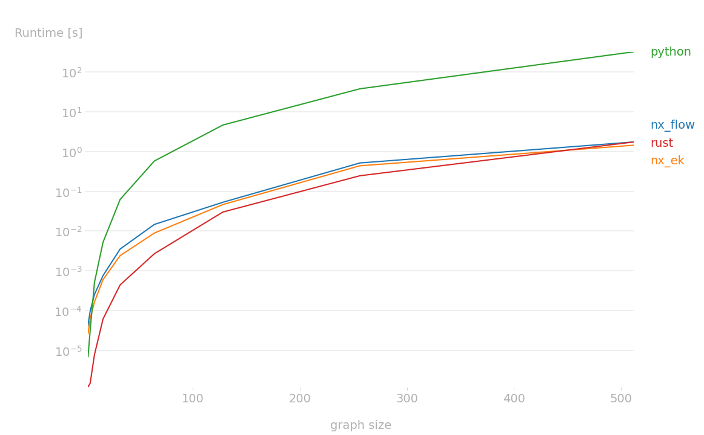

# rsgraph
Rust implementation of common graph algorithms with Python binding

## Algorithms
- [Edmonds-Karp maximum flow](https://en.wikipedia.org/wiki/Edmonds%E2%80%93Karp_algorithm)
- [Bellman-Ford shortest path](https://en.wikipedia.org/wiki/Bellman%E2%80%93Ford_algorithm)

## Prerequisites
- Rust >= 1.56
- Python >= 3.7

## Installation
You can install the package `rsgraph` using pip or by building from source.

### Using pip
```shell
$ pip install git+https://github.com/gabrielfu/rust-graph-algorithms.git
```

### Build from source
1. Clone this repository
    ```shell
    $ git clone https://github.com/gabrielfu/rust-graph-algorithms.git
    $ cd rust-graph-algorithms
    ```

2. Create virtual environment
    ```shell
    $ python -m venv ./venv
    $ source ./venv/bin/activate
    ```

3. Install Python libraries
    ```shell
    $ pip install -r requirements.txt
    ```

4. Build package
    ```shell
    $ python setup.py develop
    ```


## Examples
### Edmonds-Karp
```python
import rsgraph
import numpy as np

capacity = np.array([
    [0, 1, 0],
    [0, 0, 1],
    [0, 0, 0],
]).astype(np.float64)
s = 0
t = 2
flow = rsgraph.edmonds_karp(capacity, s, t)
print(flow)
```
Output:
```python
1.0
```

### Bellman-Ford
```python
import rsgraph
import numpy as np

adj = np.array([
    [ 0, 10,  8,  4],
    [ 4,  0,  0,  0],
    [ 0, 13,  0, 14],
    [ 8,  9, 15,  0],
]).astype(np.float64)
source = 0
distance, path = rsgraph.bellman_ford(adj, source)
print(distance)
print(path)
```
Output:
```python
{3: 4.0, 0: 0.0, 2: 8.0, 1: 10.0}
{2: [0, 2], 3: [0, 3], 1: [0, 1], 0: [0]}
```

## Benchmarking
1. Install Python libraries
    ```shell
    $ pip install -r ./benchmark/requirements.txt
    ```

2. Run 
    ```shell
    $ python ./benchmark/main.py
    ```

### Edmonds-Karp
Benchmarking against `networkx` (nx) and pure python implementation:
```
Benchmarking: Edmonds-Karp
Graph size: 32
nx_flow: 100 loops, best of 5: 3.97 msec per loop
nx_ek: 50 loops, best of 5: 3.24 msec per loop
python: 5 loops, best of 5: 41.8 msec per loop
rust: 1000 loops, best of 5: 266 usec per loop
```

Using `perfplot`:


### Bellman-Ford
Benchmarking against `networkx` (nx)
```
Benchmarking: Bellman-Ford
Graph size: 8
nx_bf: 5000 loops, best of 5: 41.1 usec per loop
rust: 10000 loops, best of 5: 20.8 usec per loop
```
