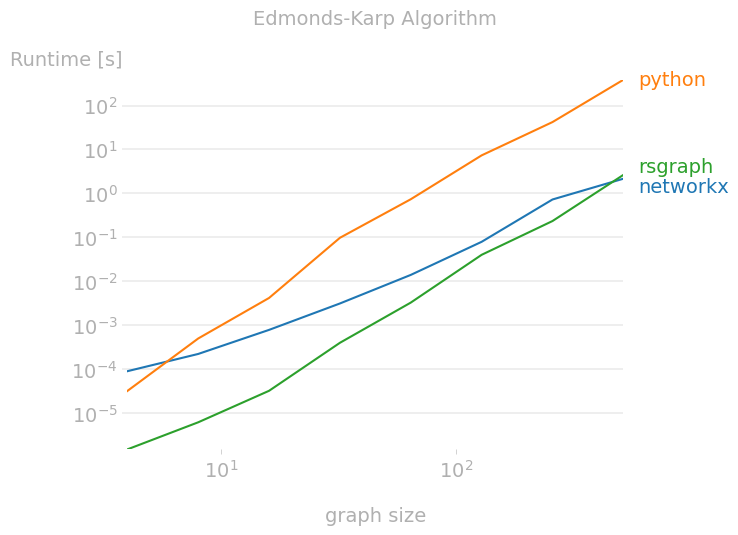
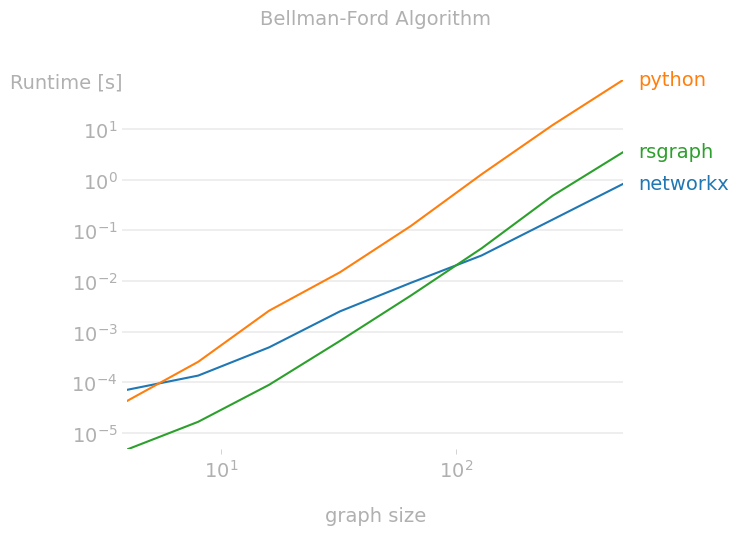
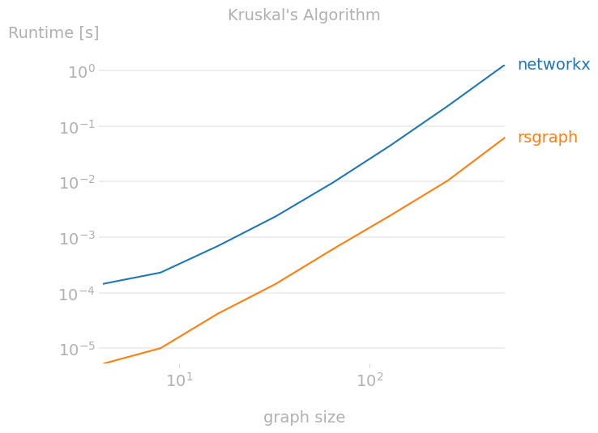

# rsgraph
Python wrapper API of Rust implementation of common graph algorithms

This package is orders of magnitude faster than pure Python implementation, 
and is up to 10x faster than `networkx` for small graph (size < 100).

## Algorithms
- [Edmonds-Karp maximum flow](https://en.wikipedia.org/wiki/Edmonds%E2%80%93Karp_algorithm)
- [Bellman-Ford shortest path](https://en.wikipedia.org/wiki/Bellman%E2%80%93Ford_algorithm)
- [Kruskal minimum spanning tree](https://en.wikipedia.org/wiki/Kruskal%27s_algorithm)

## Prerequisites
- Rust >= 1.56
- Python >= 3.7

## Installation
You can install the package `rsgraph` using pip or by building from source.

### Using pip
```shell
$ pip install git+https://github.com/gabrielfu/rsgraph.git
```

### Build from source
1. Clone this repository
    ```shell
    $ git clone https://github.com/gabrielfu/rsgraph.git
    $ cd rsgraph
    ```

2. Create virtual environment
    ```shell
    $ python -m venv ./venv
    $ source ./venv/bin/activate
    ```

3. Install Python libraries
    ```shell
    $ pip install -r requirements.txt
    ```

4. Build package
    ```shell
    $ python setup.py install
    ```
    Note: if you run `python setup.py develop`, a much slower debug version will be built.


## Examples
### Edmonds-Karp
```python
import rsgraph
import numpy as np

capacity = np.array([
    [0, 1, 0],
    [0, 0, 1],
    [0, 0, 0],
]).astype(np.float64)
s = 0
t = 2
flow = rsgraph.edmonds_karp(capacity, s, t)
print(flow)
```
Output:
```python
1.0
```

### Bellman-Ford
```python
import rsgraph
import numpy as np

adj = np.array([
    [ 0, 10,  8,  4],
    [ 4,  0,  0,  0],
    [ 0, 13,  0, 14],
    [ 8,  9, 15,  0],
]).astype(np.float64)
source = 0
distance, path = rsgraph.bellman_ford(adj, source)
print(distance)
print(path)
```
Output:
```python
{3: 4.0, 0: 0.0, 2: 8.0, 1: 10.0}
{2: [0, 2], 3: [0, 3], 1: [0, 1], 0: [0]}
```

### Kruskal
```python
import rsgraph
import numpy as np

adj = np.array([
    [0, 4, 2, 0, 0, 0],
    [4, 0, 1, 8, 0, 0],
    [2, 1, 0, 0, 4, 0],
    [0, 8, 0, 0, 2, 1],
    [0, 0, 4, 2, 0, 7],
    [0, 0, 0, 1, 7, 0],
]).astype(np.float64)
mst = rsgraph.kruskal(adj)
print(mst)
```
Output:
```python
[[0. 0. 2. 0. 0. 0.]
 [0. 0. 1. 0. 0. 0.]
 [2. 1. 0. 0. 4. 0.]
 [0. 0. 0. 0. 2. 1.]
 [0. 0. 4. 2. 0. 0.]
 [0. 0. 0. 1. 0. 0.]]
```

## Benchmarking
Run benchmarking script against `networkx` and pure Python implementation.

1. Install Python libraries
    ```shell
    $ pip install -r ./benchmark/requirements.txt
    ```

2. Run 
    ```shell
    $ python ./benchmark/main.py
    ```

### Edmonds-Karp
```
Benchmarking: Edmonds-Karp Algorithm
Overall ---------------------------------------- 100% 0:00:00
Kernels ----------------------------------------   0% -:--:--
┌─────┬───────────┬───────────┬───────────┐
│ n   │ networkx  │ python    │ rsgraph   │
├─────┼───────────┼───────────┼───────────┤
│ 4   │ 90.1 usec │ 32 usec   │ 1.5 usec  │
│ 8   │ 223 usec  │ 500 usec  │ 6.2 usec  │
│ 16  │ 785 usec  │ 4.18 msec │ 32.3 usec │
│ 32  │ 3.13 msec │ 97.7 msec │ 399 usec  │
│ 64  │ 14 msec   │ 737 msec  │ 3.28 msec │
│ 128 │ 79.2 msec │ 7.34 sec  │ 40.1 msec │
│ 256 │ 727 msec  │ 42 sec    │ 235 msec  │
│ 512 │ 2.16 sec  │ 385 sec   │ 2.64 sec  │
└─────┴───────────┴───────────┴───────────┘
```


### Bellman-Ford
```
Benchmarking: Bellman-Ford Algorithm
Overall ---------------------------------------- 100% 0:00:00
Kernels ----------------------------------------   0% -:--:--
┌─────┬───────────┬───────────┬───────────┐
│ n   │ networkx  │ python    │ rsgraph   │
├─────┼───────────┼───────────┼───────────┤
│ 4   │ 71.9 usec │ 43.6 usec │ 4.8 usec  │
│ 8   │ 137 usec  │ 256 usec  │ 16.8 usec │
│ 16  │ 493 usec  │ 2.6 msec  │ 90 usec   │
│ 32  │ 2.53 msec │ 14.9 msec │ 660 usec  │
│ 64  │ 9.22 msec │ 122 msec  │ 5.17 msec │
│ 128 │ 32 msec   │ 1.28 sec  │ 44.3 msec │
│ 256 │ 163 msec  │ 11.9 sec  │ 481 msec  │
│ 512 │ 830 msec  │ 93.1 sec  │ 3.51 sec  │
└─────┴───────────┴───────────┴───────────┘
```


### Kruskal
```
Benchmarking: Kruskal's Algorithm
Overall ---------------------------------------- 100% 0:00:00
Kernels ----------------------------------------   0% -:--:--
┌─────┬───────────┬───────────┐
│ n   │ networkx  │ rsgraph   │
├─────┼───────────┼───────────┤
│ 4   │ 145 usec  │ 5.3 usec  │
│ 8   │ 231 usec  │ 10.1 usec │
│ 16  │ 698 usec  │ 42.3 usec │
│ 32  │ 2.36 msec │ 144 usec  │
│ 64  │ 9.6 msec  │ 611 usec  │
│ 128 │ 44.6 msec │ 2.46 msec │
│ 256 │ 229 msec  │ 10.4 msec │
│ 512 │ 1.28 sec  │ 62.4 msec │
└─────┴───────────┴───────────┘
```

